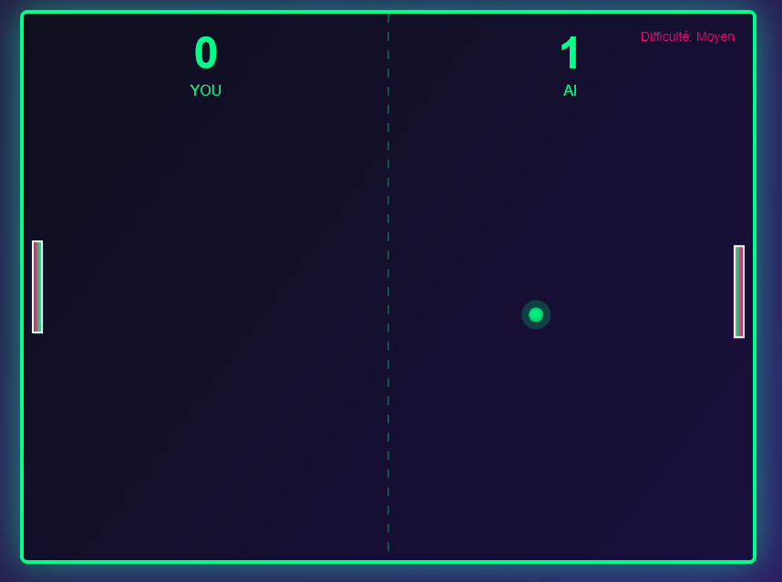

# Presentation

A pong game, only with HTML and Javascript, and no framework at all !

3 games modes :
- 1 player VS AI. 4 difficulty modes
- 1 player VS 2 player
- Demo mode with 2 AI playing together

# 📊 Global summary of AI usage

**Created with** Copilot + Claude Haiku 4.5

**From** 28 april to 1 May 2026

**Total time** : 2 hours (or less...)

## 📊 AI Usage Statistics - Copilot CLI

Auto-generated by Copilot

**Report generated**: 2026-05-01 16:02:09 UTC 
**Period**: 2026-04-28 11:50:21 UTC → 2026-05-01 14:01:34 UTC

---

### 📈 Executive Summary

| Metric | Value |
|----------|--------|
| **Total number of requests** | 278 |
| **Covered period** | 4 days |
| **Total tokens consumed** | 9,864,408 |
| **Average tokens per request** | 35,483 |
| **Peak usage** | 50.2% |
| **Model used** | gpt-5-mini (278) |

---

### 🤖 Model Information

| Model | Requests | % of Total |
|--------|----------|-----------|
| gpt-5-mini | 278 | 100.0% |

**Note**: All requests use the `gpt-5-mini` model (Claude Haiku 4.5).
